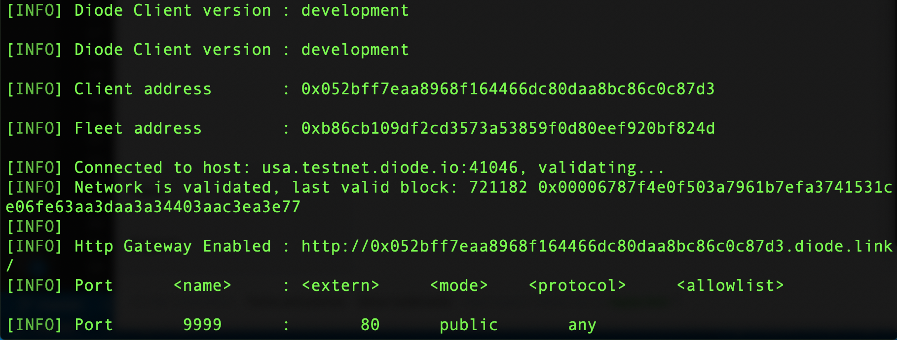

# Line Bot Template
The idea for line bot template is from https://github.com/kkdai/LineBotTemplate. This repo is focus on how to publish your line bot api through diode network, and bridge the line bot with diode gate way service without setting any SSL certificate and domain.

## Installation and Usage
1. Create line developer account and setup the message api
    Go to developer console https://developers.line.biz/console/.

2. Publish line bot through diode network
    You can copy & paste below line into a terminal to install the Diode client for your current user on macOS, Linux, Raspberry Pi (or Windows if you have curl).
    `$ curl -Ssf https://diode.io/install.sh | sh`
    If you are an expert, diode client is opensource, you can also compile diode client from source code: https://github.com/diodechain/diode_go_client.
    After diode setup, open terminal and publish line bot to diode network.
    `$ diode publish -public [line_bot_port]:80`
    If publish works, the line bot address should be `[DIODE GATEWAY ADDRESS]/callback`, eg, my api address is http://0x052bff7eaa8968f164466dc80daa8bc86c0c87d3.diode.link/callback.
    

3. Setup message api on Line bot Dashboard
    Go to message api settings, and update Webhook URL to `[DIODE GATEWAY ADDRESS]/callback`.
    
    
### Chinese Tutorial
如果你想看中文版的教學，可以到[這裡]()